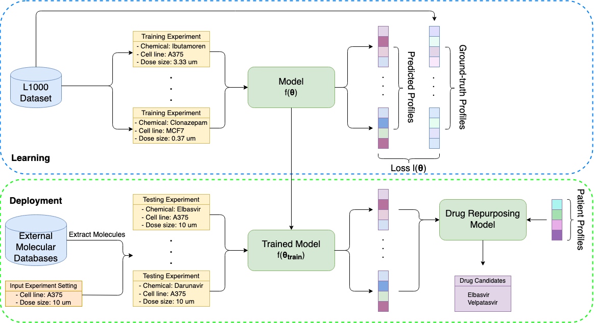

# DeepCE - A novel and robust deep learning framework for high-throughput mechanism-driven phenotype compound screening
-----------------------------------------------------------------
Code by **Thai-Hoang Pham** at Ohio State University.

## 1. Introduction
**DeepCE** is a Python implementation of the mechanism-driven neural network-based model which captures 
high-dimensional associations among biological features as well as non-linear relationships between biological features 
and outputs to predict gene expression profiles given a chemical compound.

**DeepCE** achieves state-of-the-art results of predicting gene expression profiles compared to other models not only 
in *de novo* chemical setting but also in the traditional imputation setting. More importantly, **DeepCE** is shown to be 
effective in the challenge and urgent problem, finding treatment for **COVID-19**. In summary, **DeepCE** could be a powerful 
tool for phenotype-based compound screening. 

## 2. Pipeline



Figure 1: General framework of training **DeepCE** for L1000 gene expression profile prediction and using it for 
downstream application (i.e. drug repurposing). The objective for the learning process is minimizing the loss 
between predicted profiles and grouth-truth profiles in L1000 dataset. After training, **DeepCE** is used for 
generating profiles for new chemicals in external molecular database (e.g. DrugBank, ChEMBL). These profiles 
are then used for **in silico** screening to find potential drugs for disease treatment

## 3. Installation

**DeepCE** depends on Numpy, SciPy, PyTorch (CUDA toolkit if use GPU), scikit-learn, and RDKit. 
You must have them installed before using **DeepCE**.

The simple way to install them is using conda:

```sh
	$ conda install numpy scipy scikit-learn rdkit pytorch
```
## 4. Usage

### 4.1. Data

The datasets used to train **DeepCE** are located at folder ``DeepCE/data/``

### 4.2. Training DeepCE

The training script for **DeepCE** is located at folder ``script/``

```sh
    $ cd script
    $ bash train_deepce.sh
```

Arguments in this scripts:

* ``--drug_file``:       path for SMILES representation file
* ``--gene_file``:         path for L1000 gene feature file
* ``--train_file``:        path for L1000 gene expression training data
* ``--dev_file``:        path for L1000 gene expression development data
* ``--test_file``:      path for L1000 gene expression testing data
* ``--dropout``: dropout value used in DeepCE
* ``--batch_size``:       batch size value for each training step
* ``--max_epoch``:     maximum number of training iterations

### 4.3. Getting chemical-induced gene expression profiles for all drugs in Drugbank

Besides **DeepCE** source code, we also publicize the chemical-induced gene expression profiles generated from **DeepCE** at 8 
cell lines including *A375*, *A549*, *HA1E*, *HELA*, *HT29*, *MCF7*, *PC3*, and *YAPC* for all drugs (i.e. 11179 drugs) 
in Drugbank. We hope that this dataset could make significant a contribution to drug discovery and development in 
particular, and computational chemistry and biology research in general.

The script for getting these chemical-induced gene expression profiles is located at folder ``script/``

```sh
    $ cd script
    $ bash get_gene_expression_data.sh
```

The downloaded dataset will be located at folder ``DeepCE/data/drugbank_gene_expression/``

## 5. Contact

**Thai-Hoang Pham** < pham.375@osu.edu >

Department of Computer Science and Engineering, Ohio State University, USA
